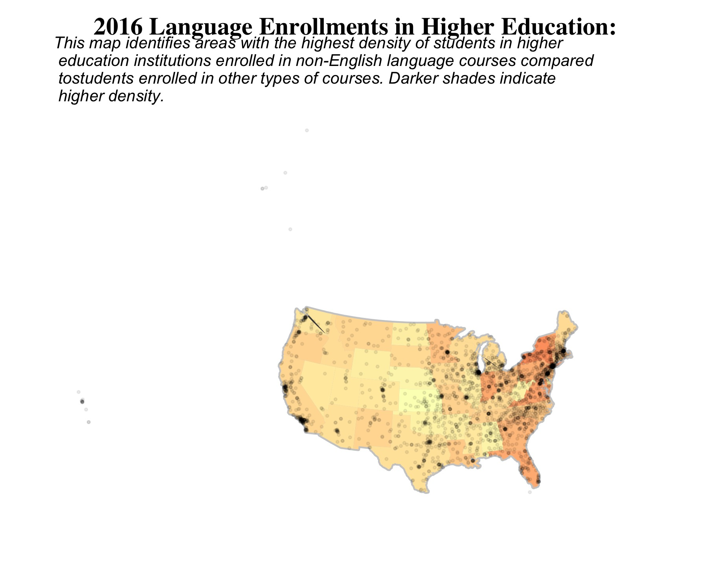
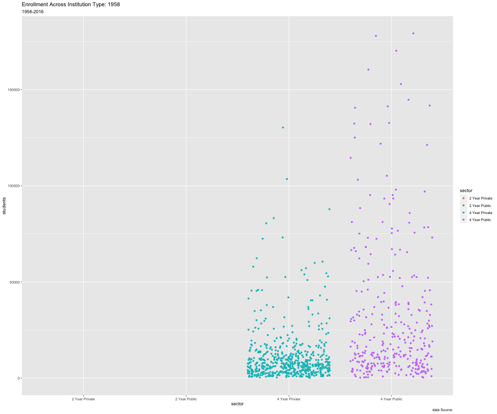

```{r setup, include=FALSE}
knitr::opts_chunk$set(echo = FALSE,
                      eval = TRUE,
                      warning = FALSE,
                      error = FALSE,
                      include = FALSE)
```

```{r Load Library}
library(here)
library(tidyverse)
library(janitor)
library(gganimate)
library(gifski)
library(png)
library(maps)
library(mapproj)
library(transformr) # double check
library(ggthemes)
```

```{r Data Import}
here::here("data")
enroll    <-  read_csv(here("data", "lang_enrolls_1958-2016.csv")) %>% 
              clean_names()
region    <-  read_csv(here("data", "lang_region.csv")) %>% 
              clean_names()
geo_code  <-  read_csv(here("data", "geo_codes.csv")) %>% # might not end up needing this one
              clean_names() 
tot_enroll <- read_csv(here("data", "subset_total_enrolls_1970-2016.csv")) %>% 
              clean_names()
ipeds_geo <-  read_csv(here("data", "ipeds_geo.csv")) %>% 
              clean_names()
inst_ic    <- read_csv(here("data", "inst_desc.csv")) %>% 
              clean_names()
grand_tot  <- read_csv(here("data", "effy2017.csv")) %>% 
              clean_names()
```

# Welcome Reviewer(s)!
This final project draft is still in very rough shape, but I hope what I have makes sense.
Thanks in advance for your comments and your time!

# Heritage Language Maintenance

### What is a heritage language and why do we need to maintain it?
[some stuff will go here]

### How is a heritage language learner different from a second language learner?
[some more stuff will go here]

### Why does it matter?
[and here]

### What is the purpose of this project?

The visualizations below are intended to convey information about enrollment trends in higher education institutions for non-English language courses in the United States. The data used was gathered from a Modern Language Association national survey implemented periodically between 1958 and 2016 which gathers information about each individual institution, including languages offered, enrollment numbers, institution type, geographic information, history of the institution's name, and accreditation.

The reason I chose this particular dataset, which does not highlight information about heritage language programs is mainly because that data does not exist on this level. Existing research and existing heritage language programs are limited and suffer a significant challenge in obscurity. Higher education institutions that *do* opt to offer heritage language courses often house them within larger modern language departments as a series of courses taken before moving into advanced language courses with second-language learners, which can significantly limit potential enrollment and interest. How do you pursue a program you don't even know exists?

This presents a few problems. Firstly, we don't have a real idea of how many institutions currently offer any type of heritage language support system(s). Secondly, even when they are present, we don't have an idea of how often they're utilized, what kind of interest they generate among students, what the major goals and interests of current programs are, and what characterizes current heritage language pedagogical practices outside of limited case studies that are not generalizable on their own. 

The hope is that this data offers a starting point. Though we can't make any inferences about heritage learners specifically, what we can understand looking at these enrollment trends are which languages are already showing stable or growing trends enough so that adding additional support systems could be more easily justifiable and implementable. It shows us which geographic areas in the country show significantly higher language learning trends as a way to approach a given area for closer scrutiny. Taking into account the limitations of this data, any sweeping generalizations about the types of programs that should or should not be implemented is not a responsible claim to make. Rather, what this data shows us is a starting point from which to argue for further data collection that can help us understand a given institution’s language program needs as reflected by student utilization and motivation. I would argue one potential avenue for research this makes room for is characterizing the student data gathered for potential recruitment efforts. Another would be cross-institutional collaboration between language departments and other departments to create course offerings that supplement student learning in other areas through non-English languages. 


[move this somewhere else] As it relates to the topic of Spanish HLPs, the data is optimistic as it shows that further research into Spanish language programs is not unfounded as SC accounts for such a large portion of LCs.

```{r Neat & Tidy - You can just ignore this chunk.}
# Need to covert geo_code into factor with 6 levels
# First fix those pesky NAs
# geo_code[c(1:11), 1] = 1
# geo_code[c(12:24), 1] = 2
# geo_code[c(25:36), 1] = 3
# geo_code[c(37:42), 1] = 4
# geo_code[c(43:51), 1] = 5
# geo_code[c(52:56), 1] = 6
#
# Now convert to factor
# geo_code$geography_code <- factor(geo_code$geography_code,
#                             levels = c(1:6))
#
# Add column for region name
# geo_code <- geo_code %>%
#   mutate(region = factor(case_when(1 %in% geography_code ~ "Northeast",
#                                    2 %in% geography_code ~ "Midwest",
#                                    3 %in% geography_code ~ "Southeast",
#                                    4 %in% geography_code ~ "Southwest",
#                                    5 %in% geography_code ~ "Rocky Mountain",
#                                    6 %in% geography_code ~ "Pacific",
#                                    TRUE ~ as.character())))
# I don't know how to figure this out right now. Check back later.
```

### Visualization 1: 
For this visualization I am highlighting enrollment trends for non-English language courses in higher education institutions. The visualization displays a combined total across all surveyed U.S. institutions, including public and private 2-year and 4-year institutions. The top 10 languages for each survey year were ranked, and the aim was to provide an animation that showed how those relationships changed over time, while also emphasizing very clearly how Spanish has, and continues, to dominate enrollment numbers, as Spanish heritage language programs are my specific area of focus.

#### The Journey
Visualization 1 comes from humble origins. My first attempt at working with the data was a series of simple static bar charts that showed enrollment numbers across years. Since no one wants to look at a series of boring bar charts, I decided to try my hand at animating in hopes it would still clearly show the overall data trend without taxing the viewer too much. In order to accomplish this I was forced to pare down my data from 1958-2016 to 1980-2016, to account for a lot of errors I kept coming up against when piping into ggplot.

Viz 1 still has a long way to go. From here, I plan to tweak colors and themes in order to make it more visually appealing and easy to read. I'm fairly happy with the speed, but there's a lot of small things that need to be adjusted. The y-axis, for one, needs a lot of work and commas need to be placed in the number. As a reviewer, there is one specific thing that would be really helpful for me if you could weigh in on: is it easier to understand this animation if the label next to the bars displays total enrollments or a breakdown of proportion (as the percentage that each language accounts for from total non-English language enrollments)?


```{r Viz 1 Draft: Language & Time, fig.height=10, fig.width=10}
# Getting data ready
# First let's get enrollment data narrowed down
ltviz <- enroll %>% 
  select(srvy_year, language, undergrad_total, grad_total) %>% 
  group_by(language, srvy_year) %>% 
  mutate(undergrad_total = sum(undergrad_total, na.rm = TRUE),
         grad_total = sum(grad_total, na.rm = TRUE),
         total = sum(undergrad_total, grad_total, na.rm = TRUE),
         srvy_year = as.numeric(stringr::str_sub(srvy_year, 1, 4))) %>% 
  ungroup() %>% 
  distinct() %>% 
  filter(srvy_year >= 1980) %>% 

# Trying to figure out how to pull the top 10 ranked for each year
# Set up labels for ranking while you're at it

  group_by(srvy_year) %>% 
  mutate(rank = rank(-total),
         value_rel = total/total[rank==1],
         value_lbl = paste0(" ", total)) %>% 
  group_by(language) %>% 
  filter(rank <= 10) %>% 
  ungroup()

# Now let's try to prep the animation

anim <- ggplot(ltviz, aes(rank, group = language)) +
  geom_tile(aes(y = total,
                height = total,
                width = 0.9, fill = language), alpha = 0.6) + 
  #scale_fill_brewer(palette = "Set2") + # Some vars are not showing up wtf
  geom_text(aes(y = 0, label = paste(language, " ")),
            vjust = 0.2, hjust = 1, size = 7) +
  geom_text(aes(y = total, label = value_lbl, hjust = 0), size = 7) + 
  coord_flip(clip = "off", expand = TRUE) + # come back to this
  scale_x_reverse() +
  theme_minimal() +
  theme(axis.line = element_blank(),
        axis.text.x = element_blank(),
        axis.text.y = element_blank(),
        axis.ticks = element_blank(),
        axis.title.x = element_blank(),
        axis.title.y = element_blank(),
        legend.position = "none",
        panel.background = element_blank(),
        panel.border = element_blank(),
        panel.grid.major = element_blank(),
        panel.grid.minor = element_blank(),
        panel.grid.major.x = element_line(size = .1, color = "gray"),
        panel.grid.minor.x = element_line(size = .1, color = "gray"),
        plot.title = element_text(family = "Times", size = 25, hjust = 0.5, 
                                  face = "bold", color = "black", vjust = -1),
        plot.subtitle = element_text(size = 20, hjust = 0.5, face = "italic", color = "black"),
        plot.background = element_blank(),
        plot.margin = margin(1, 4, 1, 8, "cm")) +
  transition_states(srvy_year, transition_length = 4, state_length = 1) + # try different transition length?
  ease_aes("sine-in-out") +
  enter_fade() +
  exit_fade() +
  labs(title = "Non-English Language Course Enrollment in Higher Ed Institutions: {closest_state}",
       caption = "Data Source: National Center for Education Statistics")

# The animation
animate(anim, nframes = 350, fps = 25, width = 1200, height = 1000,
        renderer = gifski_renderer("viz1.gif"))


# To Do List:
 # - lowercase language text
 # - figure out why some of the languages (Spanish, particularly) are not showing up when using fill
 # - Plot titles and caption
 # - Mess with theme
 # - Try bounce-in-out
 # - Adjust total label so it has commas and is to the right of Spanish block
 # - Decide if going with count or percents, and either way, need punctuation/symbol
 # - ASL label is cut off WTFFFF
```


### Visualization 2:
For this visualization I am creating a U.S. map color coded by density of students enrolled in language courses. The data used is from the year 2016--the most recent information I was able to find for both Modern Language Association's (MLA) and National Center for Education Statistics (NCES) data which were joined together to create the map. 

#### The Journey:
I suppose this visualization's journey is much harder to see; it's really been about the data behind the scenes. Though it looks like a large beige continental U.S.-shaped blob right now, I spent a lot of time navigating unfamiliar terrain to track down the different components of NCES data I needed for my vision. I had a big "I FINALLY UNDERSTAND JOINS!" moment once I was able to see how I needed to wrangle and join the datasets I had in order to compile geographic, characteristic, and enrollment data into one data frame for mapping. This initial draft shows my very first attempts with any type of map visualization. As a result, it's got a lot of holes, but I'm still currently celebrating that I was able to get anything that resembles the United States. I am hoping next week's lecture on this subject helps me get a lot further along with this visualization than I've been able to get so far.

The next step for the visualization is to actually make it do what it's supposed to do. States will be colored in by density according to the proportion of students enrolled in non-English language courses compared to total institutional enrollment for the 2016-2017 academic year. State averages of this proportion were calculated and will be used to map color by density. I'll also figure out how to add Hawaii and Alaska in at some point, and am not sure at the moment what to do with data from D.C., so that is also on my to-do list.

If I have enough time and am able to learn how, I hope to make the map interactive by allowing zoom in/out, plotting institutions, and creating a hover feature that gives institution name, total students enrolled, proportion of students in language courses, and top 5 languages being studied with numbers displayed. I do wonder if that's too much information for this plot though, and in full transparency, it feels far too ambitious at the moment.

```{r Viz 2: Geography}
# Map data for literal map
states <- map_data("state")

states %>% ggplot(aes(long, lat, map_id = region)) +
  geom_map(map = states,
           color = "gray80", fill = "gray30", size = 0.3) +
  coord_map("ortho", orientation = c(39, -98, 0))

# Adjusting enroll data for joining
enroll_map <- enroll %>% 
  select(c(2, 3, 5, 7, 11, 13, 14, 19)) %>% 
  filter(srvy_year == 2016) %>% 
  select(-c(3, 6, 7)) %>% #simplify further for test
  group_by(nces_id) %>% 
  mutate(inst_lang_total = sum(all_level_total, na.rm = TRUE)) %>% 
  ungroup() %>% 
  select(-c(2, 5)) %>% 
  unique() %>% 
  rename(unitid = nces_id)

# Now adjust ipeds_geo data for joining
enroll_geo <- ipeds_geo %>% 
  select(c(1, 11, 12))

# Join enrollment data and geographic data
enroll_map2 <- left_join(enroll_map, enroll_geo, by = "unitid")

# Great, now let's get grand total enrollments to be able to calculate density
grand_tot2 <- grand_tot %>% 
  select(1,5) %>% 
# Rename that var ew
  rename(inst_total = efytotlt) %>% 
  group_by(unitid) %>% 
  mutate(inst_total = sum(inst_total)) %>% 
  ungroup() %>% 
  unique()

# Join with joined data
enroll_map_tidy <- left_join(enroll_map2, grand_tot2, by = "unitid") %>% 
  
  # Create a variable for institutional proportion
  group_by(unitid) %>% 
  mutate(inst_prop = inst_lang_total/inst_total) %>% 
  ungroup()

# This is beautiful, and now I'm going to mess it all up by butchering it into a 50 row
# tibble I can map using total state means. The work up to this point is to have a dataset
# ready with the information I need for the plot below, and also with institution names,
# latitudes, and longitudes to add points to the map later if I'm able to.

viz2 <- enroll_map_tidy %>% 
  select(c(3, 8)) %>% 
  group_by(state) %>% 
  mutate(state_lang_prop = round(mean(inst_prop, na.rm = TRUE), digits = 3)) %>% 
  ungroup() %>% 
  select(-c(2)) %>% 
  unique() %>% 
  rename("region" = "state")

# Rename all states to fit with above map data
# Can't remember how to do it a convenient way, so going to do it a pain in the ass way.
viz2$region <- recode(viz2$region,
                     AL = "alabama",
                     AK = "alaska",
                     AZ = "arizona",
                     AR = "arkansas",
                     CA = "california",
                     CO = "colorado",
                     CT = "connecticut",
                     DC = "district of columbia",
                     DE = "delaware",
                     FL = "florida",
                     GA = "georgia",
                     HI = "hawaii",
                     ID = "idaho",
                     IL = "illinois",
                     IN = "indiana",
                     IA = "iowa",
                     KS = "kansas",
                     KY = "kentucky",
                     LA = "louisiana",
                     ME = "maine",
                     MD = "maryland",
                     MA = "massachusetts",
                     MI = "michigan",
                     MN = "minnesota",
                     MS = "mississippi",
                     MO = "missouri",
                     MT = "montana",
                     NE = "nebraska",
                     NV = "nevada",
                     NH = "new hampshire",
                     NJ = "new jersey",
                     NM = "new mexico",
                     NY = "new york",
                     NC = "north carolina",
                     ND = "north dakota",
                     OH = "ohio",
                     OK = "oklahoma",
                     OR = "oregon",
                     PA = "pennsylvania",
                     RI = "rhode island",
                     SC = "south carolina",
                     SD = "south dakota",
                     TN = "tennessee",
                     TX = "texas",
                     UT = "utah",
                     VT = "vermont",
                     VA = "virginia",
                     WA = "washington",
                     WV = "west virginia",
                     WI = "wisconsin",
                     WY = "wyoming")

# Join geo+enrollment data with map data for plotting
viz2_map <- left_join(states, viz2, by = "region")

# Finally, time to make the map.
viz2 <-
  ggplot(viz2_map, aes(long, lat, group = region)) +
    geom_map(aes(map_id = region),
           map = viz2_map,
           color = "gray80", fill = "gray30", size = 1) +
    coord_map("ortho", orientation = c(39, -98, 0)) +
    geom_polygon(aes(group = region, fill = state_lang_prop), show.legend = FALSE) +
    scale_fill_viridis_c(option = "magma", direction = -1) + # figure out how to get palette in here
  geom_point(aes(lon1516, lat1516, group = unitid), 
             data = enroll_map_tidy, alpha = 0.07, size = 0.5) + # potential interactive points?
  theme_map() +
     theme(
    #     axis.line = element_blank(),
    #     axis.text.x = element_blank(),
    #     axis.text.y = element_blank(),
    #     axis.ticks = element_blank(),
    #     axis.title.x = element_blank(),
    #     axis.title.y = element_blank(),
    #     legend.position = "none",
    #     panel.background = element_blank(),
    #     panel.border = element_blank(),
    #     panel.grid.major = element_blank(),
    #     panel.grid.minor = element_blank(),
    #     panel.grid.major.x = element_blank(),
    #     panel.grid.minor.x = element_line(size = .1, color = "gray"),
         plot.title = element_text(family = "Times", size = 15, hjust = 0.5, 
                                   face = "bold", color = "black", vjust = -1),
         plot.subtitle = element_text(size = 10, face = "italic", color = "black")) +
    #     plot.background = element_blank()) +
  labs(title = "2016 Language Enrollments in Higher Education:",
       subtitle = "This map identifies areas with the highest density of students in higher \n education institutions enrolled in non-English language courses compared \n tostudents enrolled in other types of courses. Darker shades indicate \n higher density.")

ggsave("viz2.jpg", plot = viz2)

# map_palette I can't get to work: "#fee8c8", "#fdbb84", "#e34a33"

# To Do:
 # - Figure out how to make this map work
 # - Specifically, learn args for geom_map/coord_map/geom_polygon
 # - Titles
 # - Is interactivity feasible in 3 weeks?
 # - Play with color scale
```



### Visualization 3:
Oh, boy. This thing.

Visualization 3 is similar in thought to the first visualization. It's meant to present trends over time, but this one is centered on institution type rather than language. The major divisions of public/private and 2-year/4-year+ are presented, and in the interest of readability I cut out the other variables I was originally interested in, including a breakdown by degree type.

#### The Journey
Do I even want to tell you about this journey? It's been a rough one just getting to the draft point. I had big dreams when I started. I had all sorts of ideas about flowing Sankey charts á la NYT [you know the one](https://www.nytimes.com/interactive/2018/03/19/upshot/race-class-white-and-black-men.html). But it was not meant to be. Maybe in another time, in another world, maybe with some more EDS courses under my belt...

I did find a [really cool blog post](https://www.hvitfeldt.me/blog/recreate-sankey-flow-chart/) that walks through recreating the animated Sankey chart, and I attempted to follow along with it, but I wasn't able to wrap my head around their manipulation of functions and data enough to apply it for my own purposes.

My second choice was to use geom_dotplot(), thinking I could animate an effect of dots bouncing in or out as count changes across years. What actually happened was a graph with a huge stack of dots so tall you couldn't actually see where they ended, which I was unable to fix. So I went with a safe choice instead, choosing geom_jitter() as the base for my animation. At least, I thought it was the safe choice, but I've yet to figure out how to get this visualization to display count in the manner I want.

Next steps include extensive theming and figuring out how to slow the animation speed way down.


```{r Viz 3: Institution Type, fig.height=10, fig.width=10}
# Figure out how to make an animated Sankey chart using the tot_enroll data with enroll data
# If possible, divide into tabs by region and one for totals. By state with a search function
# would also be super cool, but way outside of the time I have for this assignment.

# First things first
# We need to pare down institutional characteristics dataset

ic <- inst_ic %>% 
  select(unitid, instnm, sector)

# Recode variables in sector col
# Note we are collapsing for-profit and not-for-profit; var is irrelevant for viz
ic$sector[ic$sector == 0] <- "Administrative Unit"
ic$sector[ic$sector == 1] <- "4 Year Public"
ic$sector[ic$sector == 2] <- "4 Year Private"
ic$sector[ic$sector == 3] <- "4 Year Private"
ic$sector[ic$sector == 4] <- "2 Year Public"
ic$sector[ic$sector == 5] <- "2 Year Private"
ic$sector[ic$sector == 6] <- "2 Year Private"
ic$sector[ic$sector == 7] <- "Less than 2 Year Public"
ic$sector[ic$sector == 8] <- "Less than 2 Year Private"
ic$sector[ic$sector == 9] <- "Less than 2 Year Private"
ic$sector[ic$sector == 99] <- NA

# Pare down enroll to state, lang, & geo_code to join with ic
ic_join <- enroll %>% 
  select(nces_id, state, geography_code, srvy_year, all_level_total, term) %>% 
  #filter(srvy_year == 2016) %>% #commenting out to try to make time-lapse
  rename(unitid = nces_id) %>% 
  group_by(unitid) %>% 
  mutate("students" = sum(all_level_total, na.rm = TRUE)) %>% 
  ungroup()

# Join ic and ic_join to get language, sector, and geo data
ic_vdata <- left_join(ic_join, ic, by = "unitid") %>% 
  
  # Drop unnecessary data
  select(-c(5, 6, 8)) %>% 
  filter(sector == "4 Year Public" |
         sector == "2 Year Public" |
         sector == "4 Year Private" |
         sector == "2 Year Private") %>% 
  
  # Collapse duplicate rows
  unique()

# Recode geo_code
ic_vdata$geography_code[ic_vdata$geography_code == 1] <- "Northeast"
ic_vdata$geography_code[ic_vdata$geography_code == 2] <- "Midwest"
ic_vdata$geography_code[ic_vdata$geography_code == 3] <- "Southeast"
ic_vdata$geography_code[ic_vdata$geography_code == 4] <- "Southwest"
ic_vdata$geography_code[ic_vdata$geography_code == 5] <- "Rocky Mountain"
ic_vdata$geography_code[ic_vdata$geography_code == 6] <- "Pacific"

# I'm going to try Sankey chart first, which means I need a column of totals(?)

# NIIIIICE
# Time for a static plot to act as animation base

# Note:
# I am attempting to follow along with a blog post, adjusting for my own data,
# trying to learn how the arguments work and tweaking for my needs/aesthetic
# purposes
# Need to figure out how to cite that


# # Create sigmoid function which will mark movement of points
# sigmoid <- function(x_from, x_to, y_from, y_to, scale = 5, n = 100) {
#   x <- seq(-scale, scale, length = n)
#   y <- exp(x) / (exp(x) + 1)
#   tibble(x = (x + scale) / (scale * 2) * (x_to - x_from) + x_from,
#          y = y * (y_to - y_from) + y_from)
# }
# 
# # Data prep
# n_points <- sum(ic_vdata$students)
# data <- tibble(from = rep(4, n_points),
#                to = sample(1:4, n_points, TRUE),
#                color = sample(c("A", "B"), n_points, TRUE))
# 
# # Visualizing one point
# p <- sigmoid(0, 1, as.numeric(data[2, 1]), as.numeric(data[2, 2]),
#              n = 100, scale = 10) %>%
#   mutate(time = row_number()) %>%
#   ggplot(aes(x, y, frame = time)) +
#   geom_point() +
#   transition_states(time, transition_length = 4, state_length = 1) + # try different transition length
#   ease_aes("sine-in-out") +
#   enter_fade() +
#   exit_fade()
# 
# # animate
# gganimate(p)
# 
# animate(p, nframes = 350, fps = 25, width = 1200, height = 1000,
#         renderer = gifski_renderer("viz3.gif"))
# 
# # Trying multiple points
# p <- map_df(seq_len(nrow(data)), 
#     ~ sigmoid(0, 1, as.numeric(data[.x, 1]), as.numeric(data[.x, 2])) %>%
#       mutate(time = row_number() + .x,
#              y = y + runif(1, -0.25, 0.25))) %>%
#   ggplot(aes(x, y, frame = time)) +
#   geom_point() +
#   transition_states(time, transition_length = 4, state_length = 1) + # try different transition length
#   ease_aes("sine-in-out") +
#   enter_fade() +
#   exit_fade()
# 
# animate(p, nframes = 350, fps = 25, width = 1200, height = 1000,
#         renderer = gifski_renderer("viz3.gif"))


# Scratch all that-- IT'S NOT WORKING


# Let's try geom_jitter across years
viz3 <- ggplot(ic_vdata, aes(sector, students, group = sector)) +
          geom_jitter(aes(color = sector),
                      show.legend = FALSE) +
          transition_states(srvy_year, transition_length = 4, state_length = 1) + # need to slow down transition
          ease_aes("bounce-in-out") +
          enter_fade() +
          exit_fade() +
  theme_minimal() +
  theme(plot.title = element_text(family = "Times", size = 25, hjust = 0.5, 
                                  face = "bold", color = "black", vjust = -1),
        plot.subtitle = element_text(size = 20, hjust = 0.5, face = "italic", color = "black")) +
    labs(title = "Enrollment Across Institution Type: {closest_state}",
         subtitle = "1958-2016",
       caption = "Data Source: National Center for Education Statistics")
    # WHY THE HELL ARE MY TITLES NOT SHOWING UP???!!!!
    
# The animation    
animate(viz3, nframes = 350, fps = 25, width = 800, height = 600, #nframes
        renderer = gifski_renderer("viz3.gif"))

# To Do:
 # - Figure out transition speed
 # - Figure out if it's possible to have dots rep n, not just plot n
 # - Paths for plots? Idk, maybe give up on that idea.
 # - Labels
 # - All the aesthetics -- it's pretty ugly right now
 # - Potentially a language dimension? Color by that rather than sector which is not doing much.
 # - Annotations -- total count in plot title with year would be cool. Also percentage maybe of enrollments across type?
 # - Play with dotplot more, really seems more ideal but just cannot figure that geom out.
 # - Is interactivity too ambitious? Probably.

```



```{r Viz 1 Final}

```

```{r Viz 2 Final}

```

```{r Viz 3 Final}
# sector totals?
viz3f_data <- ic_vdata %>% 
  select(-c(1, 2, 3)) %>% 
  group_by(srvy_year, sector) %>% 
  mutate(sector_total = sum(students)) %>% 
  ungroup() %>% 
  select(-c(2)) %>% 
  unique() %>% 
    mutate(rank = rank(-sector_total),
         value_rel = sector_total/sector_total[rank==1],
         value_lbl = paste0(" ", sector_total))


viz3f <- ggplot(viz3f_data, aes(srvy_year, sector_total, 
                                group = sector,
                                color = sector,
                                size = sector_total,
                                alpha = 0.4)) +
  scale_color_brewer(palette = "Dark2") +
  geom_line() +
  geom_point() +
  scale_size(range = c(10, 34)) +
    # geom_text(aes(y = 0, label = paste(sector, " ")),
    #         vjust = 0.2, hjust = 1, size = 7) +
  geom_text(aes(x = srvy_year, y = sector_total, label = value_lbl, hjust = 0), size = 5) + 
  transition_states(srvy_year, transition_length = 10, state_length = 1) +
          ease_aes("bounce-in-out") +
          enter_fade() +
          exit_fade() +
  transition_reveal(srvy_year) +
  theme_minimal() +
  theme(plot.title = element_text(family = "Times", size = 20, hjust = 0.5, 
                                  face = "bold", color = "black", vjust = -1),
        plot.subtitle = element_text(size = 20, hjust = 0.5, face = "italic", color = "black"),
        legend.position = "none") +
    labs(title = "Enrollment Across Institution Type: {frame_along}",
         caption = "Data Source: National Center for Education Statistics")
    
# The animation    
animate(viz3f, nframes = 350, fps = 25, width = 800, height = 600, #nframes
        renderer = gifski_renderer("viz3_final.gif"))

# To Do:
 # - Figure out transition speed
 # - Figure out if it's possible to have dots rep n, not just plot n
 # - Paths for plots? Idk, maybe give up on that idea.
 # - Labels
 # - All the aesthetics -- it's pretty ugly right now
 # - Potentially a language dimension? Color by that rather than sector which is not doing much.
 # - Annotations -- total count in plot title with year would be cool. Also percentage maybe of enrollments across type?
 # - Play with dotplot more, really seems more ideal but just cannot figure that geom out.
 # - Is interactivity too ambitious? Probably.
```

