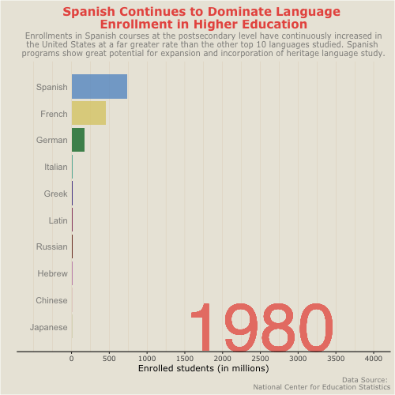
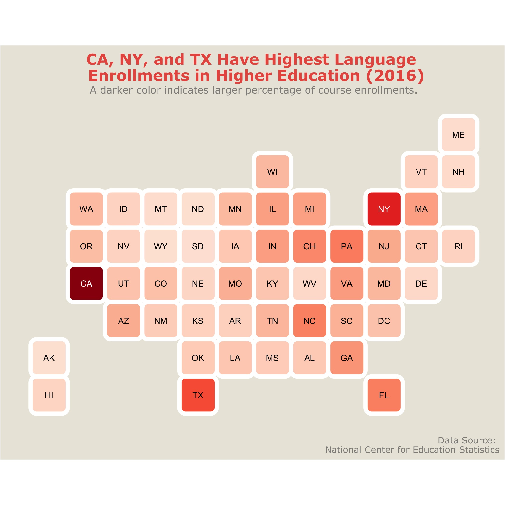
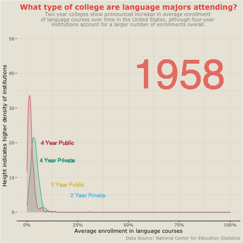

```{r setup, include=FALSE}
library(flexdashboard)
library(here)
library(tidyverse)
library(janitor)
library(gganimate)
library(gifski)
library(png)
library(maps)
library(mapproj)
library(ggthemes)
library(statebins)
library(ragg) # R Kept telling me I needed this loaded but I'm not sure why?
```

```{r Data Import, include = FALSE}
here::here("data")
enroll    <-  read_csv(here("data", "lang_enrolls_1958-2016.csv")) %>% 
              clean_names()
region    <-  read_csv(here("data", "lang_region.csv")) %>% 
              clean_names()
geo_code  <-  read_csv(here("data", "geo_codes.csv")) %>% # might not end up needing this one
              clean_names() 
tot_enroll <- read_csv(here("data", "subset_total_enrolls_1970-2016.csv")) %>% 
              clean_names()
ipeds_geo <-  read_csv(here("data", "ipeds_geo.csv")) %>% 
              clean_names()
inst_ic    <- read_csv(here("data", "inst_desc.csv")) %>% 
              clean_names()
grand_tot  <- read_csv(here("data", "effy2017.csv")) %>% 
              clean_names()
```

```{r}
# TO DO
# - Add heritage language information
# - Theming for dashboard
# - Add sidebar info
# - Double check project purpose tabs for coherence
# - Change Viz info and journeys as needed
```


Sidebar Title {.sidebar}
======================================================================
<!-- Figure out something to put in sidebar -->
[Data source:](https://www.mla.org/Resources/Research/Surveys-Reports-and-Other-Documents/Teaching-Enrollments-and-Programs/Enrollments-in-Languages-Other-Than-English-in-United-States-Institutions-of-Higher-Education) National Center for Education Statistics Language Enrollment Database from 1958-2016.

Project Purpose
=======================================================================
### Welcome!


### What is the purpose of this project?

The visualizations are intended to convey information about enrollment trends in higher education institutions for non-English language courses in the United States. The data used was gathered from a Modern Language Association national survey implemented periodically between 1958 and 2016 which gathers information about each individual institution, including languages offered, enrollment numbers, institution type, geographic information, history of the institution's name, and accreditation.

I chose this dataset despite the fact that it does not highlight information about heritage language programs, which are my area of interest, primarily because that data does not exist on this level. Existing research and existing heritage language programs are limited and suffer a significant challenge in obscurity. Higher education institutions that *do* opt to offer heritage language courses often house them within larger modern language departments as a series of courses taken before moving into advanced language courses with second-language learners, which can significantly limit potential enrollment and interest. How do you pursue a program you don't even know exists?

This presents a few problems. Firstly, we don't have a real idea of how many institutions currently offer any type of heritage language support system(s). Secondly, even when they are present, we don't have an idea of how often they're utilized, what kind of interest they generate among students, what the major goals and interests of current programs are, and what characterizes current heritage language pedagogical practices outside of limited case studies that are not generalizable on their own. 

The hope is that the larger language trends offer a starting point. Though we can't make any inferences about heritage learners specifically, what we can understand looking at enrollment trends are which languages are already showing stable or growing trends enough that adding additional support systems could be more easily justifiable and implementable. It also tells us which geographic areas in the country show significantly higher language learning trends as a way to approach a given area for closer scrutiny. Taking into account the limitations of this data, any sweeping generalizations about the types of programs that should or should not be implemented is not a responsible claim to make. Rather, what this data shows us is a perspective from which to argue for further data collection that can help us understand a given institution’s language program needs as reflected by student utilization and motivation. For example, one potential avenue this makes room for is characterizing the student data gathered for potential recruitment efforts. Another would be cross-institutional collaboration between language departments and other departments to create course offerings that supplement student learning in other areas through non-English languages. 

Heritage Language Maintenance {data-orientation=rows}
=======================================================================

### What is a heritage language and why do we need to maintain it?
[some stuff will go here]

### How is a heritage language learner different from a second language learner?
[some more stuff will go here]

### Why does it matter?
[and here]

Viz 1: Language
=======================================================================

```{r Viz 1 Draft Data Prep}
# Getting data ready
# First let's get enrollment data narrowed down
ltviz <- enroll %>% 
  select(srvy_year, language, undergrad_total, grad_total) %>% 
  group_by(language, srvy_year) %>% 
  mutate(undergrad_total = sum(undergrad_total, na.rm = TRUE),
         grad_total = sum(grad_total, na.rm = TRUE),
         total = sum(undergrad_total, grad_total, na.rm = TRUE),
         srvy_year = as.numeric(stringr::str_sub(srvy_year, 1, 4))) %>% 
  ungroup() %>% 
  distinct() %>% 
  filter(srvy_year >= 1980) %>% 

# Trying to figure out how to pull the top 10 ranked for each year
# Set up labels for ranking while you're at it

  group_by(srvy_year) %>% 
  mutate(rank = rank(-total),
         value_rel = total/total[rank==1],
         value_lbl = paste0(" ", total)) %>% 
  group_by(language) %>% 
  filter(rank <= 10) %>% 
  ungroup()
```

```{r Viz 1 Final Data Prep}
# Recode languages to lowercase
ltviz$language[ltviz$language == "FRENCH"] <- "French"
ltviz$language[ltviz$language == "GERMAN"] <- "German"
ltviz$language[ltviz$language == "GREEK, ANCIENT"] <- "Greek"
ltviz$language[ltviz$language == "HEBREW"] <- "Hebrew"
ltviz$language[ltviz$language == "LATIN"] <- "Latin"
ltviz$language[ltviz$language == "SPANISH"] <- "Spanish"
ltviz$language[ltviz$language == "CHINESE"] <- "Chinese"
ltviz$language[ltviz$language == "HEBREW, BIBLICAL"] <- "Hebrew"
ltviz$language[ltviz$language == "JAPANESE"] <- "Japanese"
ltviz$language[ltviz$language == "RUSSIAN"] <- "Russian"
ltviz$language[ltviz$language == "AMERICAN SIGN LANGUAGE (ASL)"] <- "ASL"
ltviz$language[ltviz$language == "ITALIAN"] <- "Italian"
ltviz$language[ltviz$language == "ARABIC"] <- "Arabic"
```


Row {.tabset }
-----------------------------------------------------------------------

### Final Version

```{r Viz 1 Final Version}
# Animation Prep

# Color blind safe palette 12-value for manual fill
#c("#88CCEE", "#CC6677", "#DDCC77", "#117733", "#332288", "#AA4499", 
#"#44AA99", "#999933", "#882255", "#661100", "#6699CC", "#888888")

# Main plot
anim_1f <- ggplot(ltviz) +
  aes(xmin = 0,
      xmax = total/1000000) +
  aes(ymin = rank - .45,
      ymax = rank + .45,
      y = rank) +
  facet_wrap(~srvy_year) +
  geom_rect(alpha = 0.8) + 
  aes(fill = language) +
  scale_fill_manual(values = c("#888888", "#88CCEE", "#CC6677", "#DDCC77", "#117733", "#332288", "#AA4499", "#44AA99", "#999933", "#882255", "#661100", "#6699CC")) +
  scale_x_continuous(
    limits = c(-1000, 4000),
    breaks = c(0, 500, 1000, 1500, 2000, 2500, 3000, 3500, 4000)) +
  geom_text(col = "#8e8d8a",
            hjust = "right",
            aes(label = language),
            x = -50) +
  scale_y_reverse() +
  labs(fill = NULL) +
  labs(x = "Enrolled students (in millions)") +
  labs(y = "") +
  
# Theming
  theme_classic(base_family = "Verdana") +
  theme(axis.text.y = element_blank(),
        axis.ticks.y = element_blank(),
        axis.line.y = element_blank(),
        legend.position = "none",
        plot.background = element_rect(fill = "#eae7dc"),
        panel.background = element_rect(fill = "#eae7dc"),
        panel.grid.major.x = element_line(size = .1, color = "#d8c3a5"),
        panel.grid.minor.x = element_line(size = .1, color = "#d8c3a5"),
        plot.title = element_text(size = 15, hjust = 0.5, 
                                  face = "bold", color = "#e85a4f", vjust = 0),
        plot.subtitle = element_text(size = 10, hjust = 0.5, color = "#8e8d8a"),
        plot.caption = element_text(color = "#8e8d8a")) +
  
# Labels
    labs(title = "Spanish Continues to Dominate Language \n Enrollment in Higher Education",
         subtitle = "Enrollments in Spanish courses at the postsecondary level have continuously increased in
         the United States at a far greater rate than the other top 10 languages studied. Spanish 
         programs show great potential for expansion and incorporation of heritage language study.",
         caption = "Data Source: \n National Center for Education Statistics") +
  
# Animation

# anim_1f +
  facet_null() +
  scale_x_continuous(
    limits = c(-500, 4000),
    breaks = c(0, 500, 1000, 1500, 2000, 2500, 3000, 3500, 4000)) +
  geom_text(x = 2500 , y = -10,
            family = "Helvetica",
            aes(label = as.character(srvy_year)),
            size = 30, col = "#e98074") +
  aes(group = language) +
  gganimate::transition_time(srvy_year)

#x-axis needs theme color

# Save animation
animate(anim_1f, nframes = 350, fps = 25, width = 500, height = 500,
        renderer = gifski_renderer("viz1_final.gif"))

```



### Draft Version

```{r Viz 1 Draft Version}
# Prep the animation

anim <- ggplot(ltviz, aes(rank, group = language)) +
  geom_tile(aes(y = total,
                height = total,
                width = 0.9, fill = language), alpha = 0.6) + 
  #scale_fill_brewer(palette = "Set2") + # Some vars are not showing up wtf
  geom_text(aes(y = 0, label = paste(language, " ")),
            vjust = 0.2, hjust = 1, size = 7) +
  geom_text(aes(y = total, label = value_lbl, hjust = 0), size = 7) + 
  coord_flip(clip = "off", expand = TRUE) + # come back to this
  scale_x_reverse() +
  theme_minimal() +
  theme(axis.line = element_blank(),
        axis.text.x = element_blank(),
        axis.text.y = element_blank(),
        axis.ticks = element_blank(),
        axis.title.x = element_blank(),
        axis.title.y = element_blank(),
        legend.position = "none",
        panel.background = element_blank(),
        panel.border = element_blank(),
        panel.grid.major = element_blank(),
        panel.grid.minor = element_blank(),
        panel.grid.major.x = element_line(size = .1, color = "gray"),
        panel.grid.minor.x = element_line(size = .1, color = "gray"),
        plot.title = element_text(family = "Times", size = 25, hjust = 0.5, 
                                  face = "bold", color = "black", vjust = -1),
        plot.subtitle = element_text(size = 20, hjust = 0.5, face = "italic", color = "black"),
        plot.background = element_blank(),
        plot.margin = margin(1, 4, 1, 8, "cm")) +
  transition_states(srvy_year, transition_length = 4, state_length = 1) + # try different transition length?
  ease_aes("sine-in-out") +
  enter_fade() +
  exit_fade() +
  labs(title = "Non-English Language Course Enrollment in Higher Ed Institutions: {closest_state}",
       caption = "Data Source: National Center for Education Statistics")

# The animation
animate(anim, nframes = 350, fps = 25, width = 1200, height = 1000,
        renderer = gifski_renderer("viz1.gif"))
```


Row 
----------------------------------------------------------------------
### Visualization 1: 
For this visualization I am highlighting enrollment trends for non-English language courses in higher education institutions. The visualization displays a combined total across all surveyed U.S. institutions, including public and private 2-year and 4-year institutions. The top 10 languages for each survey year were ranked, and the aim was to provide an animation that showed how those relationships changed over time, while also emphasizing very clearly how Spanish has, and continues, to dominate enrollment numbers, as Spanish heritage language programs are my specific area of focus.

#### The Journey
Visualization 1 comes from humble origins. My first attempt at working with the data was a series of simple static bar charts that showed enrollment numbers across years. Since no one wants to look at a series of boring bar charts, I decided to try my hand at animating in hopes it would still clearly show the overall data trend without taxing the viewer too much. In order to accomplish this I was forced to pare down my data from 1958-2016 to 1980-2016, to account for a lot of errors I kept coming up against when piping into ggplot.

Viz 1 still has a long way to go. From here, I plan to tweak colors and themes in order to make it more visually appealing and easy to read. I'm fairly happy with the speed, but there's a lot of small things that need to be adjusted. The y-axis, for one, needs a lot of work and commas need to be placed in the number. As a reviewer, there is one specific thing that would be really helpful for me if you could weigh in on: is it easier to understand this animation if the label next to the bars displays total enrollments or a breakdown of proportion (as the percentage that each language accounts for from total non-English language enrollments)?

Viz 2: Geography
=====================================================================

```{r Viz 2 Draft Data Prep}
# Map data for literal map
states <- map_data("state")

# Map to work from
# states %>% ggplot(aes(long, lat, map_id = region)) +
#   geom_map(map = states,
#            color = "gray80", fill = "gray30", size = 0.3) +
#   coord_map("ortho", orientation = c(39, -98, 0))

# Adjusting enroll data for joining
enroll_map <- enroll %>% 
  select(c(2, 3, 5, 7, 11, 13, 14, 19)) %>% 
  filter(srvy_year == 2016) %>% 
  select(-c(3, 6, 7)) %>% #simplify further for test
  group_by(nces_id) %>% 
  mutate(inst_lang_total = sum(all_level_total, na.rm = TRUE)) %>% 
  ungroup() %>% 
  select(-c(2, 5)) %>% 
  unique() %>% 
  rename(unitid = nces_id)

# Now adjust ipeds_geo data for joining
enroll_geo <- ipeds_geo %>% 
  select(c(1, 11, 12))

# Join enrollment data and geographic data
enroll_map2 <- left_join(enroll_map, enroll_geo, by = "unitid")

# Great, now let's get grand total enrollments to be able to calculate density
grand_tot2 <- grand_tot %>% 
  select(1,5) %>% 
# Rename that var ew
  rename(inst_total = efytotlt) %>% 
  group_by(unitid) %>% 
  mutate(inst_total = sum(inst_total)) %>% 
  ungroup() %>% 
  unique()

# Join with joined data
enroll_map_tidy <- left_join(enroll_map2, grand_tot2, by = "unitid") %>% 
  
  # Create a variable for institutional proportion
  group_by(unitid) %>% 
  mutate(inst_prop = inst_lang_total/inst_total) %>% 
  ungroup()

# This is beautiful, and now I'm going to mess it all up by butchering it into a 50 row
# tibble I can map using total state means. The work up to this point is to have a dataset
# ready with the information I need for the plot below, and also with institution names,
# latitudes, and longitudes to add points to the map later if I'm able to.

viz2 <- enroll_map_tidy %>% 
  select(c(3, 8)) %>% 
  group_by(state) %>% 
  mutate(state_lang_prop = round(mean(inst_prop, na.rm = TRUE), digits = 3)) %>% 
  ungroup() %>% 
  select(-c(2)) %>% 
  unique() %>% 
  rename("region" = "state")

# Rename all states to fit with above map data
# Can't remember how to do it a convenient way, so going to do it a pain in the ass way.
viz2$region <- recode(viz2$region,
                     AL = "alabama",
                     AK = "alaska",
                     AZ = "arizona",
                     AR = "arkansas",
                     CA = "california",
                     CO = "colorado",
                     CT = "connecticut",
                     DC = "district of columbia",
                     DE = "delaware",
                     FL = "florida",
                     GA = "georgia",
                     HI = "hawaii",
                     ID = "idaho",
                     IL = "illinois",
                     IN = "indiana",
                     IA = "iowa",
                     KS = "kansas",
                     KY = "kentucky",
                     LA = "louisiana",
                     ME = "maine",
                     MD = "maryland",
                     MA = "massachusetts",
                     MI = "michigan",
                     MN = "minnesota",
                     MS = "mississippi",
                     MO = "missouri",
                     MT = "montana",
                     NE = "nebraska",
                     NV = "nevada",
                     NH = "new hampshire",
                     NJ = "new jersey",
                     NM = "new mexico",
                     NY = "new york",
                     NC = "north carolina",
                     ND = "north dakota",
                     OH = "ohio",
                     OK = "oklahoma",
                     OR = "oregon",
                     PA = "pennsylvania",
                     RI = "rhode island",
                     SC = "south carolina",
                     SD = "south dakota",
                     TN = "tennessee",
                     TX = "texas",
                     UT = "utah",
                     VT = "vermont",
                     VA = "virginia",
                     WA = "washington",
                     WV = "west virginia",
                     WI = "wisconsin",
                     WY = "wyoming")

# Join geo+enrollment data with map data for plotting
viz2_map <- left_join(states, viz2, by = "region")
```

```{r Viz 2 Final Data Prep}
# Adjusting enrollment data by collapsing totals per year by institution
viz2f_data <- enroll %>% 
  select(srvy_year, nces_id, all_level_total, state) %>%
  group_by(nces_id, srvy_year) %>% 
  mutate(enrollments = sum(all_level_total, na.rm = TRUE)) %>% 
  ungroup() %>% 
  select(-c(3)) %>% 
  unique() %>% 
  rename(unitid = nces_id) %>%  # Rename for joining
  group_by(srvy_year, state) %>% 
  mutate(state_total = sum(enrollments), # State total enrollments by year
         inst_n = n()) %>% # Number of institutions in each state
  ungroup() %>% 
  group_by(srvy_year) %>% 
  mutate(nat_total = sum(enrollments)) %>%  # National total by year to get state average
  ungroup() %>% 
  group_by(srvy_year, state) %>% 
  mutate(state_mean = state_total/nat_total) %>% # State average
  filter(srvy_year == 2016) 
```


Row {.tabset}
-----------------------------------------------------------------------

### Final Version

```{r Viz 2 Final Version}
# Some labels for the 

# Plotting with state
viz2f <-
statebins(viz2f_data,
          value_col = "state_mean",
          name = "Percentage of enrollments",
          round = TRUE,
          palette = "Reds",
          direction = 1) +
  labs(title = "CA, NY, and TX Have Highest Language \n Enrollments in Higher Education - 2016",
       subtitle = "A darker color indicates larger percentage of course enrollments.",
       caption = "Data Source: 
       National Center for Education Statistics") +
  theme_classic(base_family = "Verdana") +
  theme(legend.position = "none",
        plot.background = element_rect(fill = "#eae7dc"),
        panel.background = element_rect(fill = "#eae7dc"),
        plot.title = element_text(size = 15, hjust = .5, 
                                  face = "bold", color = "#e85a4f", vjust = 0),
        plot.subtitle = element_text(size = 10, hjust = 0.5, color = "#8e8d8a"),
        plot.caption = element_text(color = "#8e8d8a"),
        axis.line = element_blank(),
        axis.ticks = element_blank(),
        axis.text.x = element_blank(),
        axis.text.y = element_blank())

# If time allows, add labels with percentage for CA, NY, and TX.

ggsave("viz2_final.jpg", plot = viz2f)
```



### Draft Version

```{r Viz 2 Draft Version}
# Finally, time to make the map.
viz2 <-
  ggplot(viz2_map, aes(long, lat, group = region)) +
    geom_map(aes(map_id = region),
           map = viz2_map,
           color = "gray80", fill = "gray30", size = 1) +
    coord_map("ortho", orientation = c(39, -98, 0)) +
    geom_polygon(aes(group = region, fill = state_lang_prop), show.legend = FALSE) +
    scale_fill_viridis_c(option = "magma", direction = -1) + # figure out how to get palette in here
  geom_point(aes(lon1516, lat1516, group = unitid), 
             data = enroll_map_tidy, alpha = 0.07, size = 0.5) + # potential interactive points?
  theme_map() +
     theme(
    #     axis.line = element_blank(),
    #     axis.text.x = element_blank(),
    #     axis.text.y = element_blank(),
    #     axis.ticks = element_blank(),
    #     axis.title.x = element_blank(),
    #     axis.title.y = element_blank(),
    #     legend.position = "none",
    #     panel.background = element_blank(),
    #     panel.border = element_blank(),
    #     panel.grid.major = element_blank(),
    #     panel.grid.minor = element_blank(),
    #     panel.grid.major.x = element_blank(),
    #     panel.grid.minor.x = element_line(size = .1, color = "gray"),
         plot.title = element_text(family = "Times", size = 15, hjust = 0.5, 
                                   face = "bold", color = "black", vjust = -1),
         plot.subtitle = element_text(size = 10, face = "italic", color = "black")) +
    #     plot.background = element_blank()) +
  labs(title = "2016 Language Enrollments in Higher Education:",
       subtitle = "This map identifies areas with the highest density of students in higher \n education institutions enrolled in non-English language courses compared \n tostudents enrolled in other types of courses. Darker shades indicate \n higher density.")

ggsave("viz2.jpg", plot = viz2)
```


Row
-----------------------------------------------------------------------
### Visualization 2:

### The Journey:


Viz 3: Institutions
=====================================================================

```{r Viz 3 Draft Data Prep}
# Figure out how to make an animated Sankey chart using the tot_enroll data with enroll data
# If possible, divide into tabs by region and one for totals. By state with a search function
# would also be super cool, but way outside of the time I have for this assignment.

# First things first
# We need to pare down institutional characteristics dataset

ic <- inst_ic %>% 
  select(unitid, instnm, sector)

# Recode variables in sector col
# Note we are collapsing for-profit and not-for-profit; var is irrelevant for viz
ic$sector[ic$sector == 0] <- "Administrative Unit"
ic$sector[ic$sector == 1] <- "4 Year Public"
ic$sector[ic$sector == 2] <- "4 Year Private"
ic$sector[ic$sector == 3] <- "4 Year Private"
ic$sector[ic$sector == 4] <- "2 Year Public"
ic$sector[ic$sector == 5] <- "2 Year Private"
ic$sector[ic$sector == 6] <- "2 Year Private"
ic$sector[ic$sector == 7] <- "Less than 2 Year Public"
ic$sector[ic$sector == 8] <- "Less than 2 Year Private"
ic$sector[ic$sector == 9] <- "Less than 2 Year Private"
ic$sector[ic$sector == 99] <- NA

# Pare down enroll to state, lang, & geo_code to join with ic
ic_join <- enroll %>% 
  select(nces_id, state, geography_code, srvy_year, all_level_total, term) %>% 
  #filter(srvy_year == 2016) %>% #commenting out to try to make time-lapse
  rename(unitid = nces_id) %>% 
  group_by(unitid) %>% 
  mutate("students" = sum(all_level_total, na.rm = TRUE)) %>% 
  ungroup()

# Join ic and ic_join to get language, sector, and geo data
ic_vdata <- left_join(ic_join, ic, by = "unitid") %>% 
  
  # Drop unnecessary data
  select(-c(5, 6, 8)) %>% 
  filter(sector == "4 Year Public" |
         sector == "2 Year Public" |
         sector == "4 Year Private" |
         sector == "2 Year Private") %>% 
  
  # Collapse duplicate rows
  unique()

# Recode geo_code
ic_vdata$geography_code[ic_vdata$geography_code == 1] <- "Northeast"
ic_vdata$geography_code[ic_vdata$geography_code == 2] <- "Midwest"
ic_vdata$geography_code[ic_vdata$geography_code == 3] <- "Southeast"
ic_vdata$geography_code[ic_vdata$geography_code == 4] <- "Southwest"
ic_vdata$geography_code[ic_vdata$geography_code == 5] <- "Rocky Mountain"
ic_vdata$geography_code[ic_vdata$geography_code == 6] <- "Pacific"

# I'm going to try Sankey chart first, which means I need a column of totals(?)

# NIIIIICE
# Time for a static plot to act as animation base

# Note:
# I am attempting to follow along with a blog post, adjusting for my own data,
# trying to learn how the arguments work and tweaking for my needs/aesthetic
# purposes
# Need to figure out how to cite that


# # Create sigmoid function which will mark movement of points
# sigmoid <- function(x_from, x_to, y_from, y_to, scale = 5, n = 100) {
#   x <- seq(-scale, scale, length = n)
#   y <- exp(x) / (exp(x) + 1)
#   tibble(x = (x + scale) / (scale * 2) * (x_to - x_from) + x_from,
#          y = y * (y_to - y_from) + y_from)
# }
# 
# # Data prep
# n_points <- sum(ic_vdata$students)
# data <- tibble(from = rep(4, n_points),
#                to = sample(1:4, n_points, TRUE),
#                color = sample(c("A", "B"), n_points, TRUE))
# 
# # Visualizing one point
# p <- sigmoid(0, 1, as.numeric(data[2, 1]), as.numeric(data[2, 2]),
#              n = 100, scale = 10) %>%
#   mutate(time = row_number()) %>%
#   ggplot(aes(x, y, frame = time)) +
#   geom_point() +
#   transition_states(time, transition_length = 4, state_length = 1) + # try different transition length
#   ease_aes("sine-in-out") +
#   enter_fade() +
#   exit_fade()
# 
# # animate
# gganimate(p)
# 
# animate(p, nframes = 350, fps = 25, width = 1200, height = 1000,
#         renderer = gifski_renderer("viz3.gif"))
# 
# # Trying multiple points
# p <- map_df(seq_len(nrow(data)), 
#     ~ sigmoid(0, 1, as.numeric(data[.x, 1]), as.numeric(data[.x, 2])) %>%
#       mutate(time = row_number() + .x,
#              y = y + runif(1, -0.25, 0.25))) %>%
#   ggplot(aes(x, y, frame = time)) +
#   geom_point() +
#   transition_states(time, transition_length = 4, state_length = 1) + # try different transition length
#   ease_aes("sine-in-out") +
#   enter_fade() +
#   exit_fade()
# 
# animate(p, nframes = 350, fps = 25, width = 1200, height = 1000,
#         renderer = gifski_renderer("viz3.gif"))


# Scratch all that-- IT'S NOT WORKING
```

```{r Viz 3 Final Data Prep}
# Join datasets to include geography codes, enrollment, students, and sector
viz3final_data <- left_join(ic_join, ic, by = "unitid") %>% 
  select(-c(2, 6, 8)) %>% 
  group_by(unitid, srvy_year) %>% 
  mutate(all_level_total = sum(all_level_total, na.rm = T)) %>% 
  ungroup() %>% 
  unique() %>% 
  mutate(avg_enroll = all_level_total/students) %>%  # average enrollment
  filter(sector == "4 Year Public" |
         sector == "2 Year Public" |
         sector == "4 Year Private" |
         sector == "2 Year Private") # snag variables I'm interested in

# Recode geo_code
viz3final_data$geography_code[viz3final_data$geography_code == 1] <- "Northeast"
viz3final_data$geography_code[viz3final_data$geography_code == 2] <- "Midwest"
viz3final_data$geography_code[viz3final_data$geography_code == 3] <- "Southeast"
viz3final_data$geography_code[viz3final_data$geography_code == 4] <- "Southwest"
viz3final_data$geography_code[viz3final_data$geography_code == 5] <- "Rocky Mountain"
viz3final_data$geography_code[viz3final_data$geography_code == 6] <- "Pacific"
```


Row {.tabset}
-----------------------------------------------------------------------

### Final Version

```{r Viz 3 Final Version}
# Final plot
viz3f_ne <-
ggplot(viz3final_data, aes(avg_enroll, color = sector)) +
  geom_density(aes(fill = sector), alpha = 0.2) +
  xlim(-.1, 1) +
  ylim(0, 50) +
  scale_color_manual(values = c("#88CCEE", "#DDCC77", "#44AA99", "#CC6677")) +
  scale_fill_manual(values = c("#88CCEE", "#DDCC77", "#44AA99", "#CC6677")) +
  facet_wrap(~srvy_year) +
  #labeling
  geom_text(aes(x = 0.3, 
                y = 5, 
                label = "2 Year Private"), 
            size = 4, 
            color = "#88CCEE") +
  geom_text(aes(x = 0.2, 
                y = 8, 
                label = "2 Year Public"), 
            size = 4, 
            color = "#DDCC77") +
  geom_text(aes(x = 0.15, 
                y = 15, 
                label = "4 Year Private"), 
            size = 4, 
            color = "#44AA99") +
  geom_text(aes(x = 0.15, 
                y = 20, 
                label = "4 Year Public"), 
            size = 4, 
            color = "#CC6677") +
  #theming
  theme_classic(base_family = "Verdana") +
  theme(#axis.text.y = element_blank(),
        #axis.ticks.y = element_blank(),
        axis.line.y = element_blank(),
        legend.position = c(0.75, 0.3),
        legend.title = element_text(color = "#8e8d8a", size = 10),
        legend.text = element_text(color = "#8e8d8a", size = 10),
        legend.background = element_rect(fill = "#eae7dc"),
        plot.background = element_rect(fill = "#eae7dc"),
        panel.background = element_rect(fill = "#eae7dc"),
        panel.grid.major.x = element_line(size = .1, color = "#d8c3a5"),
        panel.grid.minor.x = element_line(size = .1, color = "#d8c3a5"),
        panel.grid.major.y = element_line(size = .1, color = "#d8c3a5"),
        panel.grid.minor.y = element_line(size = .1, color = "#d8c3a5"),
        plot.title = element_text(size = 15, hjust = 0.5, 
                                  face = "bold", color = "#e85a4f", vjust = 0),
        plot.subtitle = element_text(size = 10, hjust = 0.5, color = "#8e8d8a"),
        plot.caption = element_text(color = "#8e8d8a")) +
  scale_x_continuous(labels = scales::percent) +
  #titles
  labs(x = "Average enrollment in language courses",
       y = "Height indicates higher density of institutions",
       title = "What type of college are language majors attending?",
       subtitle = "Two year colleges show pronounced increase in average enrollment \n of language courses over time in the United States, although four-year \n institutions account for a larger number of enrollments overall.",
       caption = "Data Source: National Center for Education Statistics") +
  #animation
  facet_null() +
  geom_text(x = 0.75 , 
            y = 40,
            family = "Helvetica",
            aes(label = as.character(srvy_year)),
            size = 30, 
            color = "#e98074") +
  aes(group = sector) +
  transition_time(srvy_year)

# Save animation
 animate(viz3f_ne, nframes = 350, fps = 25, width = 500, height = 500,
         renderer = gifski_renderer("viz3f_final_anim.gif"))
```



### Draft Version

```{r Viz 3 Draft Version}
# Let's try geom_jitter across years
viz3 <- ggplot(ic_vdata, aes(sector, students, group = sector)) +
          geom_jitter(aes(color = sector),
                      show.legend = FALSE) +
          transition_states(srvy_year, transition_length = 4, state_length = 1) + # need to slow down transition
          ease_aes("bounce-in-out") +
          enter_fade() +
          exit_fade() +
  theme_minimal() +
  theme(plot.title = element_text(family = "Times", size = 25, hjust = 0.5, 
                                  face = "bold", color = "black", vjust = -1),
        plot.subtitle = element_text(size = 20, hjust = 0.5, face = "italic", color = "black")) +
    labs(title = "Enrollment Across Institution Type: {closest_state}",
         subtitle = "1958-2016",
       caption = "Data Source: National Center for Education Statistics")
    # WHY THE HELL ARE MY TITLES NOT SHOWING UP???!!!!
    
# The animation    
animate(viz3, nframes = 350, fps = 25, width = 800, height = 600, #nframes
        renderer = gifski_renderer("viz3.gif"))
```


### Fun Version

Just as a reminder of where I started.

```{r Viz 3 Fun Version}
# sector totals?
viz3f_data <- ic_vdata %>% 
  select(-c(1, 2, 3)) %>% 
  group_by(srvy_year, sector) %>% 
  mutate(sector_total = sum(students)) %>% 
  ungroup() %>% 
  select(-c(2)) %>% 
  unique() %>% 
    mutate(rank = rank(-sector_total),
         value_rel = sector_total/sector_total[rank==1],
         value_lbl = paste0(" ", sector_total))


viz3f <- ggplot(viz3f_data, aes(srvy_year, sector_total, 
                                group = sector,
                                color = sector,
                                size = sector_total,
                                alpha = 0.4)) +
  scale_color_brewer(palette = "Dark2") +
  geom_line() +
  geom_point() +
  scale_size(range = c(10, 34)) +
    # geom_text(aes(y = 0, label = paste(sector, " ")),
    #         vjust = 0.2, hjust = 1, size = 7) +
  geom_text(aes(x = srvy_year, y = sector_total, label = value_lbl, hjust = 0), size = 5) + 
  transition_states(srvy_year, transition_length = 10, state_length = 1) +
          ease_aes("bounce-in-out") +
          enter_fade() +
          exit_fade() +
  transition_reveal(srvy_year) +
  theme_minimal() +
  theme(plot.title = element_text(family = "Times", size = 20, hjust = 0.5, 
                                  face = "bold", color = "black", vjust = -1),
        plot.subtitle = element_text(size = 20, hjust = 0.5, face = "italic", color = "black"),
        legend.position = "none") +
    labs(title = "Enrollment Across Institution Type: {frame_along}",
         caption = "Data Source: National Center for Education Statistics")
    
# The animation    
animate(viz3f, nframes = 350, fps = 25, width = 800, height = 600, #nframes
        renderer = gifski_renderer("viz3_final.gif"))
```


Row
-----------------------------------------------------------------------
### Visualization 3:

### The Journey: