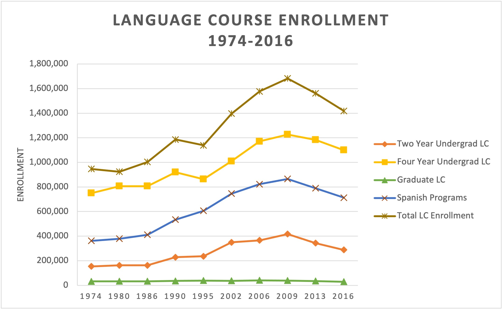
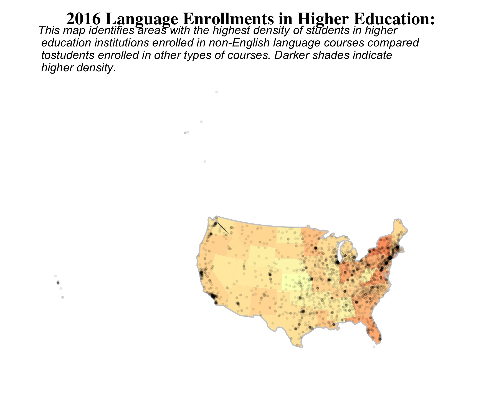

```{r}
# TO DO
# - Add heritage language information
# - Double check project purpose tabs for coherence
# - Change Viz info and journeys as needed
```

Sidebar Title {.sidebar}
======================================================================
Visualizations created by Janette Avelar for EDLD 652 Data Visualizations (Winter 2021).

Data gathered from the National Center for Education Statistics (NCES): Integrated Postsecondary Education Data System's (IPED) Institutional Characteristics (IC) survey and the Modern Language Association (MLA) Enrollments in Languages Other Than English in United States Institutions of Higher Education survey.

Data Sources:
 
[MLA Language Enrollment Survey](https://www.mla.org/Resources/Research/Surveys-Reports-and-Other-Documents/Teaching-Enrollments-and-Programs/Enrollments-in-Languages-Other-Than-English-in-United-States-Institutions-of-Higher-Education)

[NCES Institutional Characteristics Survey](https://nces.ed.gov/ipeds/use-the-data/survey-components/4/institutional-characteristics)

Project Purpose
=======================================================================
Column
-----------------------------------------------------------------------

### 

#### Welcome!


Row
-----------------------------------------------------------------------

### 

#### What is the purpose of this project?

The following visualizations are intended to convey information about enrollment trends in higher education institutions for non-English language courses in the United States. The data used was compiled from a Modern Language Association (MLA) national survey implemented periodically between 1958 and 2016 which gathers information about each individual institution, including languages offered, enrollment numbers, institution type, geographic information, history of the institution's name, and accreditation, together with the NCES IPEDS Institutional Characteristics (IC) Survey data.

Though my primary interest is in studying heritage language programs and support systems in postsecondary institutions, I chose to analyze this dataset despite the fact that it does not highlight information about heritage language programs primarily because that data does not exist on this level. Existing research and existing heritage language programs are limited and suffer a significant challenge in obscurity. Higher education institutions that *do* opt to offer heritage language courses often house them within larger modern language departments as a series of courses taken before moving into advanced language courses with second-language learners, which can significantly limit potential enrollment and interest. How do you pursue a program you don't even know exists?

This problem has several ramifications for my ability to conduct further research. Firstly, I don't have a real idea of how many institutions currently offer any type of heritage language support system(s). Secondly, even when they are present, I don't have an idea of how often they're utilized, what kind of interest they generate among students, what the major goals and interests of current programs are, and what characterizes current heritage language pedagogical practices outside of limited case studies that are not generalizable on their own. 

The hope is that the larger language trends offer a starting point. Though we can't make any inferences about heritage learners specifically using this data, what we can understand looking at enrollment trends are which languages are showing enrollment stability or growth to the extent that additional support systems could be more easily justifiable and implementable. It also tells us which geographic areas in the country show significantly higher language learning trends as a way to approach a given area for closer scrutiny. 

Taking into account the limitations of this data, any sweeping generalizations about the types of programs that should or should not be implemented is not a responsible claim to make. Rather, what this data presents is a perspective from which to argue for further data collection that can help us understand a given institution’s language program needs as reflected by student utilization and motivation. For example, one potential avenue this makes room for is characterizing the student data gathered for potential recruitment efforts. Another would be cross-institutional collaboration between language departments and other departments to create course offerings that supplement student learning in other areas through non-English languages.

Heritage Language Maintenance {data-orientation=rows}
=======================================================================
#### Heritage Language Maintenance

#### What is a heritage language and why do we need to maintain it?

More broadly, the term heritage language refers to any language that is not the dominant language in a given place. In the U.S., that means any language besides English that an individual has had significant exposure to early in their life. Similar terms include native language, first language, or home language. 

The reason I use the term heritage language is to refer to a specific relationship between the language, associated culture, and one’s identity. Heritage languages are also often associated with patterns of diminished language use or complete loss across generations, even when it’s present as the home language. For example, I am a second-generation immigrant with parents from El Salvador and Honduras, and I grew up speaking Spanish at home. Despite that, growing up in the U.S. within a monolingual school system has impacted my ability to speak and write in Spanish, and, more generally, to communicate with other Spanish speakers. I know from firsthand experience that this language loss is more important than a matter of developing bilingualism or multilingualism. It has real, personal, socio-cultural and psychological impacts for a large number of individuals and families.


#### How is a heritage language learner different from a second language learner?

Due to prior target language exposure (Oh & Au, 2005) and sociocultural variables (Oh & Fuligni, 2010), heritage learners are a unique subgroup that are more likely to develop native-like proficiency. They benefit from more intensive reading, writing, and vocabulary instruction than is typically integrated into foreign language learning classrooms (Torres et al., 2019). Heritage language learners have different needs than students who are learning a foreign language, though they share similar grammatical and lexical abilities at lower-proficiency levels (Lynch, 2008). Despite this, heritage language programs continue to be under-utilized and heritage language learners are left behind in classrooms that do not meet what they need to develop full proficiency.

#### Why higher education?
Research on language use of bilingual and multilingual speakers in the United States has historically focused on measuring English skills rather than use of minority language(s). Partly because of the hegemonic presence of monolingual education, bilingual and multilingual speakers’ native languages have exhibited patterns of loss, as in the *third-generation shift* (Alba et. al., 2002), which describes decreased minority language proficiency for second-generation heritage language learners and minimal heritage language proficiency for the following third generation (Pease-Alvarez, 2002). In other words, following immigration to the U.S., the heritage language is severely diminished or completely lost by the third generation. Language loss can occur despite early language exposure as individuals experience first-language diminishment or loss (Beaudrie & Ducar, 2005). 

Despite the growth of bilingual programs that aim to preserve and develop bi-/multi-lingualism, a well-documented pattern reflects decreased heritage language use during adolescence for heritage learners (Geerlings et. al., 2015). These findings have highlighted the importance of the relationship between language use and self-identification (Geerlings et. al., 2015), suggesting a need to address both issues: identity development in conjunction with language use for heritage language learners. Young adults provide a key demographic for heritage language maintenance as individuals who are at a pivotal moment in their personal development. A potential way to study young adulthood lies in conducting research within higher education institutions as they have the added benefit of providing organizational structure to access this population. By implementing stronger support systems and programs in postsecondary schools to meet the specific needs of heritage learners, we can help address both language loss and issues of self-identification while developing multilingualism for personal and professional goals.

#### References

Alba, R., Logan, J., Lutz, A., & Stults, B. (2002). Only English by the third generation? Loss and preservation of the mother tongue among the grandchildren of contemporary immigrants. Demography, 39, 467-484.

Beaudrie, S., & Ducar, C. (2005). Beginning level university programs: Creating a space for all heritage language learners. Heritage Language Journal, 3(1), 1.

Geerlings, J., & Verkuyten, M., Thijs, J. (2015). Changes in ethnic self-identification and heritage language preference in adolescence: A cross-lagged panel study. Journal of Language and Social Psychology, 34(5), 501-520.

Lynch, A. (2008). The linguistic similarities of Spanish heritage and second language learners. Foreign Language Annals, 41, 252-281.

Oh, J.S., & Au, T. (2005). Learning Spanish as a heritage language: The role of sociocultural background variables. Language Culture and Curriculum, 18, 229-241.

Oh, J.S., & Fuligni, A.J. (2010). The role of heritage language development in the ethnic identity and family relationships of adolescents from immigrant backgrounds. Social Development, 19, 202-220.

Pease-Alvarez, L. (2002). Moving beyond linear trajectories of language shift and bilingual language socialization. Hispanic Journal of Behavioral Sciences, 24, 114-137. 

Torres, K.M., Arrastia, C., & Tackett, S. (2019). University Spanish heritage language coursework: Meeting the needs of all heritage learners. Journal of Hispanic Higher Education, 18(1), 59-76.

U.S. Department of Education. Institute of Education Sciences, National Center for Education Statistics.


Viz 1 {data-orientation=rows}
=======================================================================

Column
-----------------------------------------------------------------------

### Final Version


Column {.tabset}
-----------------------------------------------------------------------

### Draft Version


### Excel Version


Row 
----------------------------------------------------------------------
### Description 

#### The Idea 
This visualization is intended to highlight enrollment trends for non-English language courses in higher education institutions. The visualization displays a combined total across all surveyed U.S. institutions, including public and private 2-year and 4-year institutions. The top 10 languages for each survey year were ranked, and the aim was to provide an animation that showed how those relationships changed over time, while also emphasizing very clearly how Spanish has, and continues, to dominate enrollment numbers. Spanish language programs in higher education are important targets for developing heritage language programs for the clear reason that they are already heavily utilized, and as Latinxs in the U.S. grow to just under 20% of the country’s population. As an added bonus for myself, Spanish heritage language programs are my specific area of focus.

#### The Journey

**Idea to Draft:**

Visualization 1 comes from humble origins. My first attempt at working with the data was a series of simple static bar charts that showed enrollment numbers across years. To make a more visually appealing plot that emphasized yearly change in a clear way, I decided to try my hand at animating in hopes it would still show the overall data trend without taxing the viewer too much. In order to accomplish this I was forced to pare down my data from 1958-2016 to 1980-2016, to account for a lot of errors I kept coming up against when piping into {ggplot2}.

My first draft managed to present the information I needed but suffered from a lot of issues. Labels were cut off, the colors were unappealing, and it just looked bad. It was, however, my first experience with animations, so I should also point out that I was very proud of that draft version. As I continued to work with the gganimate package and had the chance to see others’ projects, I was inspired to do extensive theming for my final version.

**Draft to Final Version:**

For the final version, I recoded labels to fit in the graph, worked on my titles to emphasize what I want the viewer to learn from the visualization, chose a colorblind-friendly palette to work with, and added a large clear label to indicate year. I was torn on the idea of paring down the number of languages presented, especially because the enrollment numbers for Spanish obscure the other values significantly. Ultimately, I chose to keep the Top 10 languages, mostly because a lot of the movement occurs in the middle groups and I thought it was interesting to present that information.

One of the largest decisions I made was to get rid of the labels that showed enrollment count for each language. Originally I toyed with the idea of showing the percentage of total enrollment for each language rather than a full count. I asked my reviewers about this, and they seemed to like the labels as they were. Ultimately, the more time I spent with the animation, the more I thought the labels simply added unnecessary clutter into a plot that has enough going on and felt it was best to get rid of them entirely. It gave me more room to develop a longer title and subtitle to let the reader know exactly what I want them to take away from the visualization.


Viz 2 {data-orientation=rows}
=====================================================================

Column
-----------------------------------------------------------------------

### Final Version


Column
-----------------------------------------------------------------------

### Draft Version



Row
-----------------------------------------------------------------------
### Description

#### The Idea
The second visualization is a heatmap of the United States, filled with a continuous orange to red color scale in order to highlight which states held the highest percentages of language course enrollments in 2016, the most recent survey year for the data used.

#### The Journey
I started out hoping to create a U.S. map color coded by density of students enrolled in language courses that also detailed individual institutional information. I had grand visions of an interactive map that allowed the viewer to zoom in/out and use a hover feature that would reveal information about overall language enrollments and top 5 languages studied. It was far too ambitious.

**Idea to Draft:**

I suppose this visualization's journey is much harder to see; it's really been about the data behind the scenes. Though it looks like a large beige continental U.S.-shaped blob, I spent a lot of time navigating unfamiliar terrain to track down the different components of NCES data I needed for my vision. I had a big *I FINALLY UNDERSTAND JOINS!* moment once I was able to see how I needed to wrangle and join the datasets in order to compile geographic, characteristic, and enrollment data into one data frame for mapping. This initial draft shows my very first attempts with any type of map visualization. As a result, it's got a lot of holes, but it was still a big win for my work in this course.

**Draft to Final Version:**

After the lecture on geographic data I was really intrigued by the {statebins} package. One of the big reasons I chose it was because I found it more visually appealing, but it also solved an issue I was having with the draft. I didn’t know how to wrestle with the “Is this just showing population density?” issue that seems common with maps, and it was starting to feel like too much to figure out how to solve that issue and also build something fully interactable when I was struggling just to get Hawaii and Alaska into the same plot.

Ultimately, my reasons for going the {statebins} route were both practical and aesthetic. This visualization solves the issue of density and overplotting evident in my first draft. It also ensures every state is easily read and uniform in size, thus minimizing visual errors from analyzing spatial data.

I considered animating the plot to show trends over time since that had been the central point of the project in order to understand language enrollment in its current context. However, when I ended up with what became my final plot, I was far more intrigued by the California, New York, and Texas story that came through. The draft and final plot told very different stories from each other, both of which were surprising to me. I expected to see higher language enrollments in border states. I’m intrigued to know why some of the states show higher enrollments (Pennsylvania, Ohio, North Carolina) and why California, Texas, and New York have enrollment rates so much higher than the rest of the country.


Viz 3 {data-orientation=rows}
=====================================================================

Column
-----------------------------------------------------------------------

### Final Version


Column {.tabset}
-----------------------------------------------------------------------

### Draft Version


### Unintentionally Fun Version

Just as a reminder of where I started.


Row
-----------------------------------------------------------------------
### Description

#### The Idea
Visualization 3 originated closely in thought to the first visualization, and mimics it in certain ways. It's meant to present trends over time but centered on institution type rather than language. The major divisions of public/private and 2-year/4-year+ are presented, and in the interest of readability I cut out the other variables I was originally interested in, including a breakdown by degree type and region.

#### The Journey

**Idea to Draft:**

Oh, boy. This thing.

It was a rough journey just getting to the draft. I had big dreams when I started. I had all sorts of ideas about flowing Sankey charts á la New York Times [(you know the one)](https://www.nytimes.com/interactive/2018/03/19/upshot/race-class-white-and-black-men.html). But it was not meant to be. Maybe in another time, in another world, maybe with some more EDS courses under my belt...

I did find a [really cool blog post](https://www.hvitfeldt.me/blog/recreate-sankey-flow-chart/) that walks through recreating the animated Sankey chart, and I attempted to follow along with it, but I wasn't able to wrap my head around their manipulation of functions and data enough to apply it for my own purposes.

My second choice was to use geom_dotplot(), thinking I could animate an effect of dots bouncing in or out as count changes across years. What actually happened was a graph with a huge stack of dots so tall they extended well beyond the limits of my graph, which I was unable to fix. So I went with a safe choice instead, choosing geom_jitter() as the base for the first animation. At least, I thought it was the safe choice, but I wasn't able to figure out how to get the visualization to display count in the manner I envisioned.

**Draft to Final Version:**

This visualization has come a long way from the draft version, and still has a ways to go. The aesthetic choices I made were to stay in line with the rest of the project, including the use of the earlier palette chosen for Visualization 1. I also made the decision to move the legend and year into the plot for easy readability. I hoped to create a series of animations that presented the same information across regions in the United States, but the task required more extensive work with the data than I had time for. I was forced to abandon that plan when I began mapping the Midwest and encountered huge errors due to missing data. The attempt made for a good lesson in realizing longitudinal survey data may not always line up.

In the interest of full disclosure, I’m still not fully happy with the limits set or the animation speed. Given more time I would tweak those areas along with some minor aesthetics. I would also try to address the dramatic spikes in the plot. That being said, I was determined to move away from the original simple line charts I made in Excel, and am excited the animation shows movement toward new areas of conceptualizing how information can be communicated.

**Unintentionally Fun Version:**
This is a plot that occurred between the draft and final versions. I chose to keep it as a reminder of how difficult learning R can be, but how despite its difficulties it also comes with little moments of joy.
