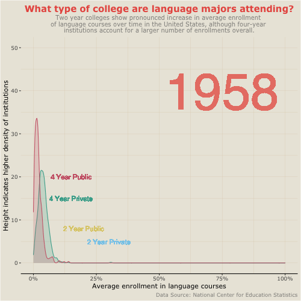

```{r}
# TO DO
# - Add heritage language information
# - Theming for dashboard
# - Add sidebar info
# - Double check project purpose tabs for coherence
# - Change Viz info and journeys as needed
```

Sidebar Title {.sidebar}
======================================================================
Visualizations created by Janette Avelar for University of Oregon's EDLD 652 Data Visualization course (Winter 2021).

Data gathered from the National Center for Education Statistics: Integrated Postsecondary Education Data System. Data used from Institutional Characteristics (IC) survey.

Data Sources:
 
[Language Enrollment Database:](https://www.mla.org/Resources/Research/Surveys-Reports-and-Other-Documents/Teaching-Enrollments-and-Programs/Enrollments-in-Languages-Other-Than-English-in-United-States-Institutions-of-Higher-Education) National Center for Education Statistics Language Enrollment Database from 1958-2016.

[Institutional Characteristics](https://nces.ed.gov/ipeds/use-the-data/survey-components/4/institutional-characteristics) NCES IPEDS

Project Purpose
=======================================================================
Column
-----------------------------------------------------------------------

### 

#### Welcome!


Row
-----------------------------------------------------------------------

### 

#### What is the purpose of this project?

The visualizations are intended to convey information about enrollment trends in higher education institutions for non-English language courses in the United States. The data used was gathered from a Modern Language Association national survey implemented periodically between 1958 and 2016 which gathers information about each individual institution, including languages offered, enrollment numbers, institution type, geographic information, history of the institution's name, and accreditation.

I chose this dataset despite the fact that it does not highlight information about heritage language programs, which are my area of interest, primarily because that data does not exist on this level. Existing research and existing heritage language programs are limited and suffer a significant challenge in obscurity. Higher education institutions that *do* opt to offer heritage language courses often house them within larger modern language departments as a series of courses taken before moving into advanced language courses with second-language learners, which can significantly limit potential enrollment and interest. How do you pursue a program you don't even know exists?

This presents a few problems. Firstly, we don't have a real idea of how many institutions currently offer any type of heritage language support system(s). Secondly, even when they are present, we don't have an idea of how often they're utilized, what kind of interest they generate among students, what the major goals and interests of current programs are, and what characterizes current heritage language pedagogical practices outside of limited case studies that are not generalizable on their own. 

The hope is that the larger language trends offer a starting point. Though we can't make any inferences about heritage learners specifically, what we can understand looking at enrollment trends are which languages are already showing stable or growing trends enough that adding additional support systems could be more easily justifiable and implementable. It also tells us which geographic areas in the country show significantly higher language learning trends as a way to approach a given area for closer scrutiny. Taking into account the limitations of this data, any sweeping generalizations about the types of programs that should or should not be implemented is not a responsible claim to make. Rather, what this data shows us is a perspective from which to argue for further data collection that can help us understand a given institution’s language program needs as reflected by student utilization and motivation. For example, one potential avenue this makes room for is characterizing the student data gathered for potential recruitment efforts. Another would be cross-institutional collaboration between language departments and other departments to create course offerings that supplement student learning in other areas through non-English languages. 

Heritage Language Maintenance {data-orientation=rows}
=======================================================================
#### Heritage Language Maintenance

#### What is a heritage language and why do we need to maintain it?
[some stuff will go here]

#### How is a heritage language learner different from a second language learner?
[some more stuff will go here]

#### Why does it matter?
[and here]

Viz 1 {data-orientation=rows}
=======================================================================

Column
-----------------------------------------------------------------------

### Final Version


Column {.tabset}
-----------------------------------------------------------------------

### Draft Version


### Excel Version


Row 
----------------------------------------------------------------------
### Description 

#### Visualization 1: 
For this visualization I am highlighting enrollment trends for non-English language courses in higher education institutions. The visualization displays a combined total across all surveyed U.S. institutions, including public and private 2-year and 4-year institutions. The top 10 languages for each survey year were ranked, and the aim was to provide an animation that showed how those relationships changed over time, while also emphasizing very clearly how Spanish has, and continues, to dominate enrollment numbers, as Spanish heritage language programs are my specific area of focus.

#### The Journey
Visualization 1 comes from humble origins. My first attempt at working with the data was a series of simple static bar charts that showed enrollment numbers across years. Since no one wants to look at a series of boring bar charts, I decided to try my hand at animating in hopes it would still clearly show the overall data trend without taxing the viewer too much. In order to accomplish this I was forced to pare down my data from 1958-2016 to 1980-2016, to account for a lot of errors I kept coming up against when piping into ggplot.

Viz 1 still has a long way to go. From here, I plan to tweak colors and themes in order to make it more visually appealing and easy to read. I'm fairly happy with the speed, but there's a lot of small things that need to be adjusted. The y-axis, for one, needs a lot of work and commas need to be placed in the number. As a reviewer, there is one specific thing that would be really helpful for me if you could weigh in on: is it easier to understand this animation if the label next to the bars displays total enrollments or a breakdown of proportion (as the percentage that each language accounts for from total non-English language enrollments)?

Viz 2 {data-orientation=rows}
=====================================================================

Column
-----------------------------------------------------------------------

### Final Version


Column
-----------------------------------------------------------------------

### Draft Version


Row
-----------------------------------------------------------------------
### Description

#### Visualization 2:

#### The Journey:


Viz 3 {data-orientation=rows}
=====================================================================

Column
-----------------------------------------------------------------------

### Final Version



Column {.tabset}
-----------------------------------------------------------------------

### Draft Version


### Unintentionally Fun Version

Just as a reminder of where I started.


Row
-----------------------------------------------------------------------
### Description

#### Visualization 3:

#### The Journey: